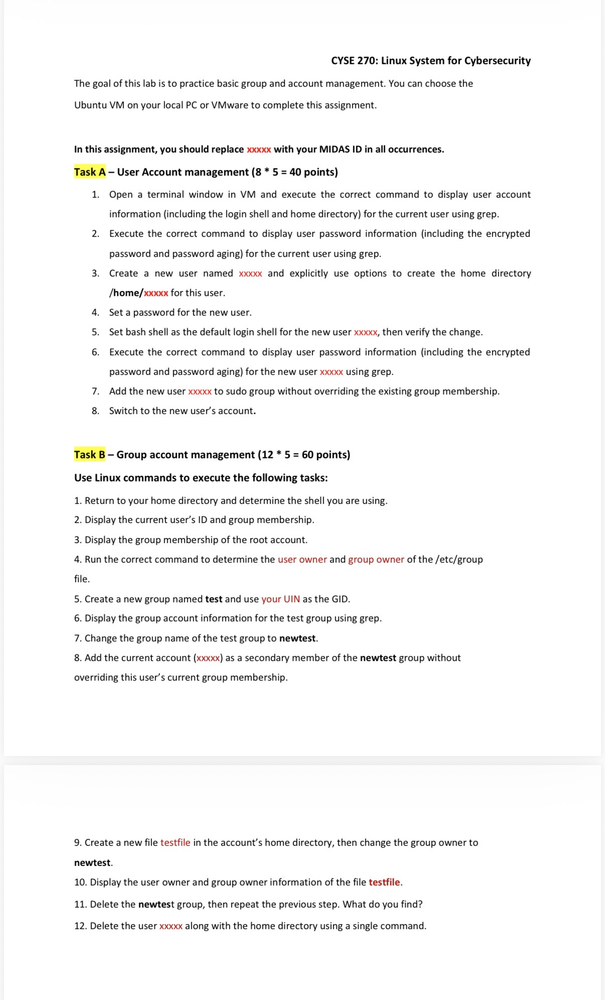
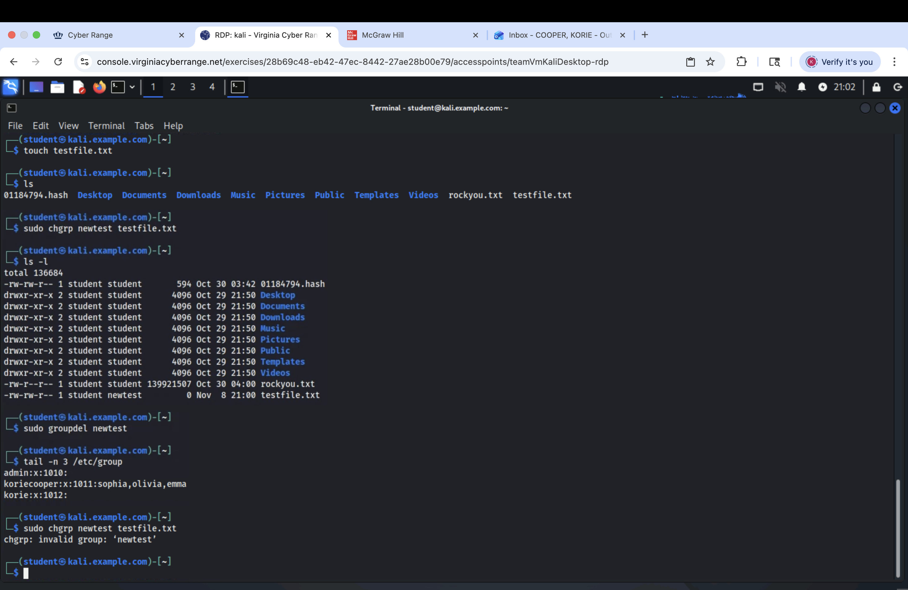

<h1>Group and User Management</h1>

<h2>Description</h2>
This project demonstrates my ability to manage user and group accounts in a Linux environment using command line tools. The tasks required a strong understanding of system administration commands, file permissions, authentication settings, account creation, group management, and shell configuration. Throughout the project, I used the terminal to create and manage users, configure password settings, modify groups, and verify ownership and permissions using standard Linux utilities.
<br />


<h2>Languages and Utilities Used</h2>

- <b> Bash Shell </b> 

<h2>Environments Used </h2>

- <b>Kali Linux VM </b>

<h2>Program walk-through:</h2>

<p align="center">
Tasks assigned for the lab:  <br/>

<br />
<br />

<br />
<br />
<br/>

<br />
<br />

<br />
<br />


<!--
 ```diff
- text in red
+ text in green
! text in orange
# text in gray
@@ text in purple (and bold)@@
```
--!>
